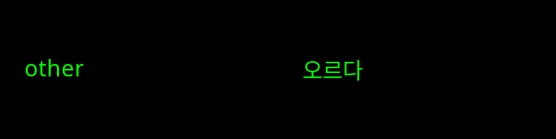
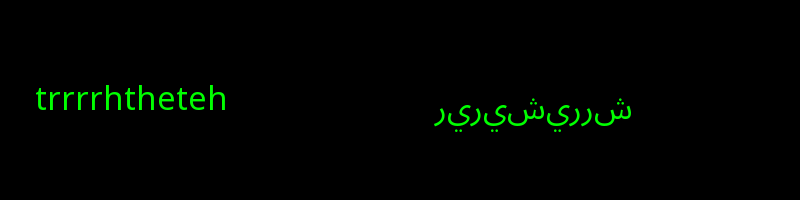
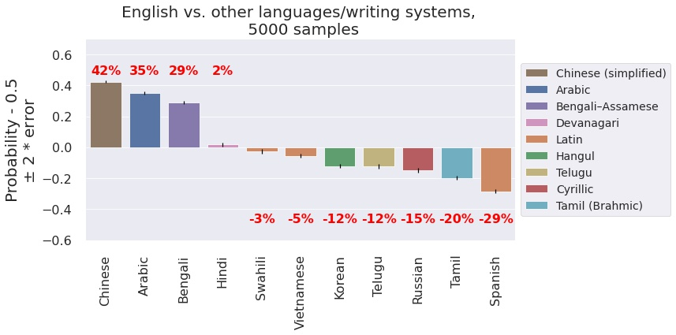
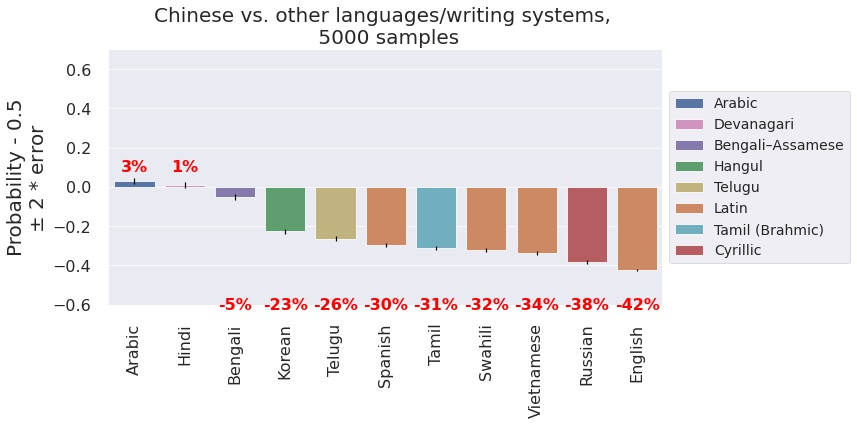
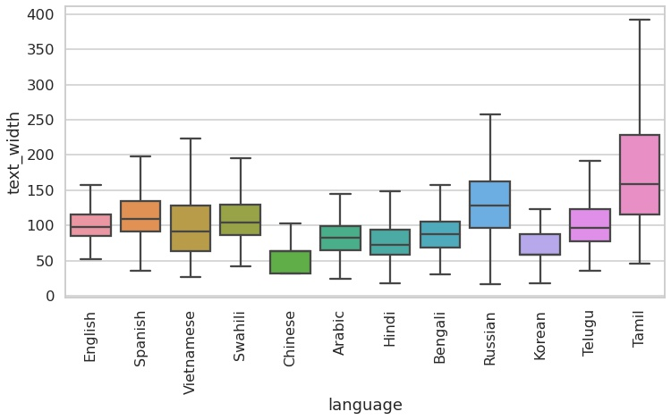
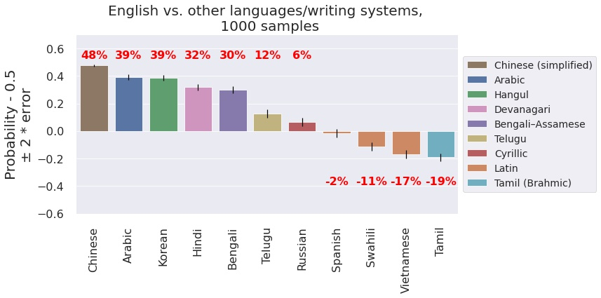
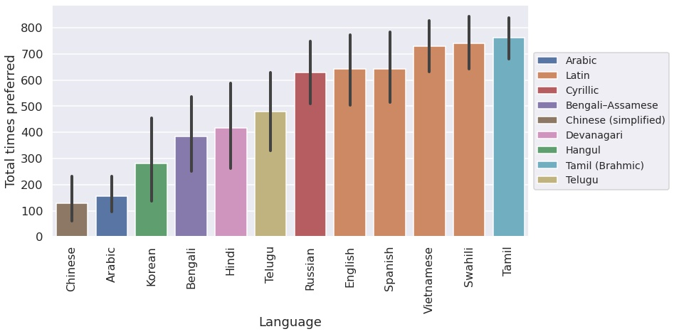
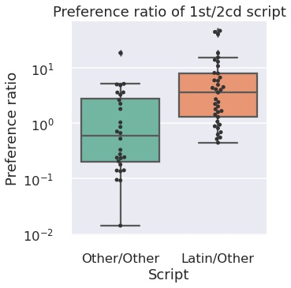
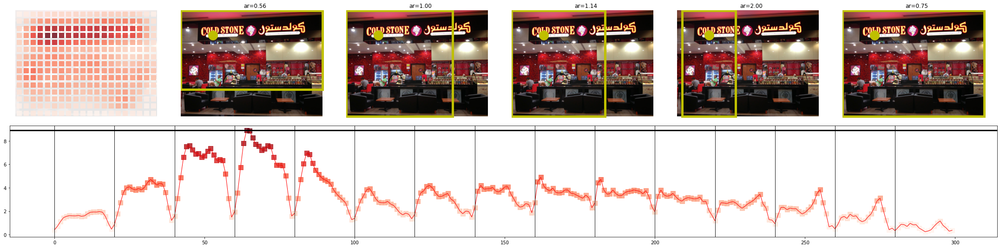
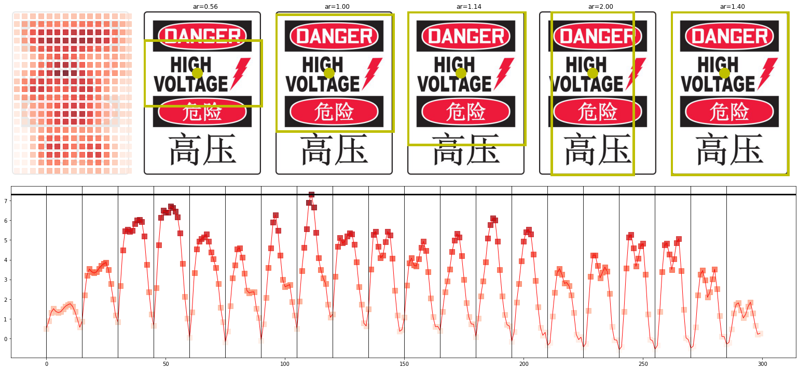

# Language bias in an image cropping algorithm

## Intro

A recent paper from a research group at Twitter identified racial and gender bias in a saliency algorithm that is used to generate image crops. The paper notes that words/text are highly salient in images. I was inspired by this fact to investigate if the saliency algorithm would exhibit bias when multiple languages are present in a image. Multilingual signs are a  common scenario on street signs and business across the entire world. A bias towards cropping one language (or script type) over another could cause unintentional harm by erasing an essential aspect of a particular culture or ethnic group. The saliency algorithm + argmax function exhibited a dramatic preference for  Latin alphabet based  scripts (English, Vietnamese, Swahili, Spanish) to non Latin based scripts (e.g. Chinese, Arabic). There were group differences in the the generated text images that could explain the bias. However, a follow up analysis where text width was controlled still resulted in a Latin-based script bias. There are interesting prefereneces in the non Latin-based languages/scripts that are not explored here, but may be worth further research. 

## Method

The base word set was generated from  a list of 1,000 of the most common words in English. Only words with length > 4 were kept, yielding 530 words. The `base set` was translated into 10  languages ['Arabic', 'English', 'Spanish', 'Russian', 'Swahili', 'Bengali', 'Vietnamese', 'Chinese', 'Hindi', 'Korean', 'Tamil', 'Telugu'] using Microsoft's Translator on Azure Cognitive Services. Each language has a particular script returned by the translator (e.g. it returns simplified rather than traditional Chinese, see Table 1 for language/script pairs). Each language/script was paired with every other language/script pair, yield 66 pairs. From each pairing, a word was drawn from the base word set corresponding to each language. This process was repeated 500,1000, or 5000 depending on the the analysis (repeat number was constrained by computational resources/time, can be increased for future analysis).  An additional dataset set (`width-matched nonense word set`) was generated to match the width of the generated text across all languages. 

## Datasets

**Table 1, Dataset 1**: `base set`. Example translations to each language and corresponding scripts. Note how different languages have different lengths of strings. This could influence the saliency model, if one language tends to have more characters. This motivated the generation of dataset 2 in Table 2.

| Text                      | Language   | Script          |
|:--------------------------|:-----------|:---------------------|
| hello world               | English    | Latin                |
| Hola mundo                | Spanish    | Latin                |
| Chào thế giới             | Vietnamese | Latin                |
| Vipi dunia                | Swahili    | Latin                |
| 世界您好                  | Chinese    | Chinese (simplified) |
| مرحبا بالعالم             | Arabic     | Arabic               |
| हैलो वर्ल्ड                  | Hindi      | Devanagari           |
| হ্যালো ওয়ার্ল্ড              | Bengali    | Bengali–Assamese     |
| Всем привет               | Russian    | Cyrillic             |
| 전 세계 여러분 안녕하세요 | Korean     | Hangul               |
| హలో వరల్డ్                   | Telugu     | Telugu               |
| ஹலோ உலகம்                  | Tamil      | Tamil (Brahmic)      |

**Figure 1.** Image submitted to the model. Random English (left) vs Korean(right) words from the `base set`.

**Table 2, Dataset 2**: `width-matched nonense word set`. Example translations to each language and corresponding scripts. Each word was generated by grabbing random characters from the language and building the word until it was at least 175 pixels wide. 

| Text           | Language   | Script          |
|:---------------|:-----------|:---------------------|
| asiiiitnsnttia | English    | Latin                |
| etsstatsants   | Spanish    | Latin                |
| ốhhốốcccốố     | Vietnamese | Latin                |
| PhppaopPa      | Swahili    | Latin                |
| 瞬瞬间间瞬瞬   | Chinese    | Chinese (simplified) |
| هاراللهرهالور  | Arabic     | Arabic               |
| ण्णकण्षष््षष्       | Hindi      | Devanagari           |
| ্কষ্কাষতকত       | Bengali    | Bengali–Assamese     |
| еовввеоннв     | Russian    | Cyrillic             |
| 간순순간순순간 | Korean     | Hangul               |
| ాటట్ెపపుటట        | Telugu     | Telugu               |
| ொொடநந          | Tamil      | Tamil (Brahmic)      |

**Figure 2.** Image submitted to the model. Nonsense word English (left) vs Arabic(right) words from the `width-matched nonense word set`.

## Results - Dataset1

**Figure.** The positive values indicate that English is preferred over the other language. Negative values indicate the other language was preferred. Maximum value 50%. The corresponding script types are in the legend. There are dramatic preference for and against English in this analysis, However I noticed that some languages had longer words on the image (Tamil, ) and some had shorter (Chinese, Arabic).

**Figure.** Same as above, with Chinese as the comparison language. In a sense, it looks like this text is "anti-preferred" by the saliency algorithm.

## Results - Word width from Dataset1

**Figure.** Certain languages tend to haver shorter/longer words. This may influence the saliency model, so Dataset 2 was generated to correct for this.

## Results - Dataset2

### Language parity plots across width-matched nonsense words dataset

**Figure.** Here we see that English is preferred to most other languages, except the other Latin-based scripts and Tamil.

### General preference for Latin-based scripts across width-matched nonsense words dataset

**Figure**-Dataset: `width matched nonsense words`. Total times the saliency model preferred each language, across all pairs. The four Latin-based languages were generally preferred the most. Interestingly, Tamil was also highly preferred (even in these width matched dataset).  Something about this script seems to be intrinsically interesting.

**Figure**-Dataset: `width matched nonsense words`. Latin-scripts are preferred by the saliency cropping algorithm over all other scripts when compared to others scripts. Preference ratio is the number of times the algorithm chose either Latin vs Other scripts or Other vs Other scripts. Independent samples t-test show a significant difference in groups (t = 2.46, p = 0.016). 

## Real world examples

## Submission scoring

Base points: 

This harm  can be considered 'erasure', a language/significant culture aspect is removed preferentially from image. Or 'ex-nomination', treating Latin-based scripts (dominate in the western world) as central human norm, especially when compared to scripts found in the East. This harm is unintentional. Given this, I calculated score for both categories

Multipliers 

+ Damage: The harm is against a single axis of identity/cultural signifier (language)(1.2 + 1.2) / 2 = 1.2

+ Affected users: Most users of Twitter, especially those speak and take images of non Latin-based text. 1.2

+ Likelihood: Text is very prevalent in images, will happen often. 1.3

+ Exploitability: N/A

+ Justification: . 1.25

+ Clarity: Methodology reproducible in notebooks. Explored a potential confound (text width) and confirmed the harm was still present when controlling. Additional text parameters could be explored 1.25

+ Creativity: industry standard, no multiplier

  

If erasure: 15 X (1.2+1.2+1.3+1.25+1.25) = 93

If ex-nomination: 15 X (1.2+1.2+1.3+1.25+1.25) = 124

